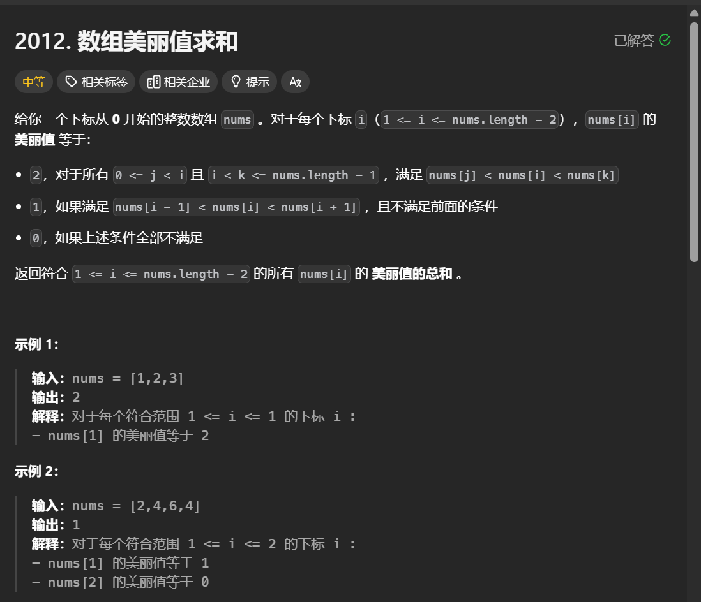
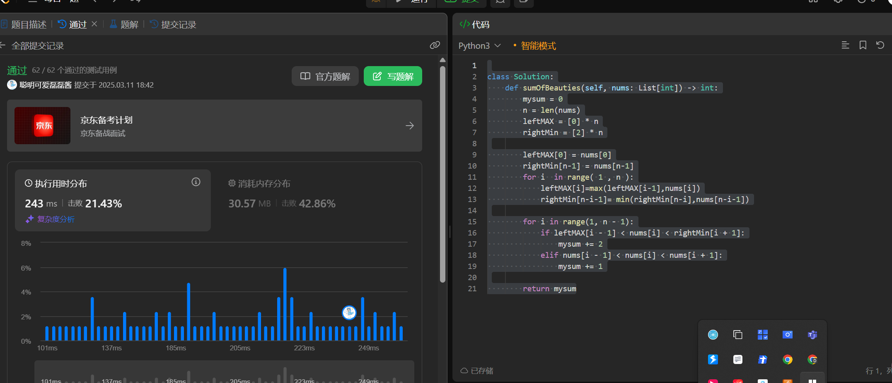

解释   

数组中间的每一个书的判定  

给2   就是   比左边最大的数还要大   比右边最小的数还要小  

就是经典先遍历一遍  获得前面最大的和右边最小的状态数组 

然后再遍历一遍就行 

```python
class Solution:
    def sumOfBeauties(self, nums: List[int]) -> int:
        mysum = 0
        n = len(nums)
        leftMAX = [0] * n
        rightMin = [2] * n

        leftMAX[0] = nums[0]
        rightMin[n-1] = nums[n-1]
        for i  in range( 1 , n ):
            leftMAX[i]=max(leftMAX[i-1],nums[i])
            rightMin[n-i-1]= min(rightMin[n-i],nums[n-i-1])

        for i in range(1, n - 1):
            if leftMAX[i - 1] < nums[i] < rightMin[i + 1]:
                mysum += 2
            elif nums[i - 1] < nums[i] < nums[i + 1]:
                mysum += 1

        return mysum
```


